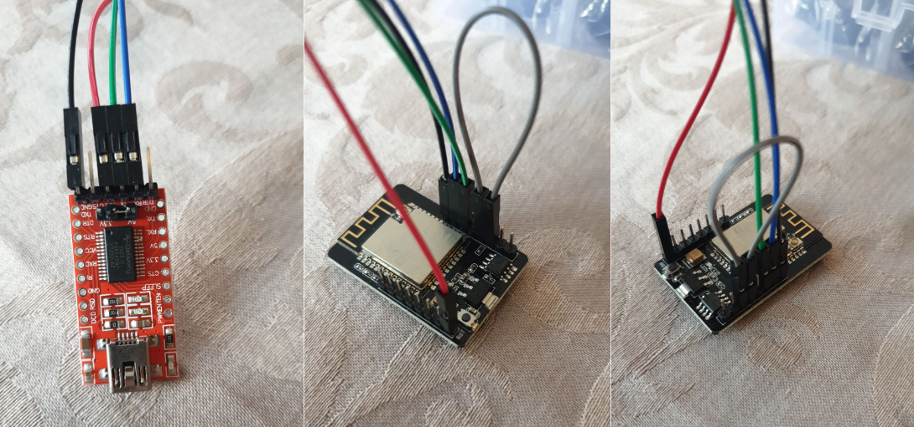

# RobonectCam

## Objectives
### The ESP32-Cam has no USB port
- USB32-Cam: https://www.amazon.de/gp/product/B08MZV1TT9
- Due to the lack of an USB port, I have to use an FTDI programmer (https://www.amazon.de/gp/product/B01N9RZK6I)

### Attach a bigger and stronger antenna
- Antenna: https://www.amazon.de/gp/product/B0895ZQ7CV/ref=ppx_yo_dt_b_asin_title_o01_s00?ie=UTF8&psc=1
- Tutorial for switching to an external antenna: https://randomnerdtutorials.com/esp32-cam-connect-external-antenna/

## Considerations
- WiFi credentials shouldn't be hardcoded and under GIT but dynamically loaded from a SD card.
  --> That way, Olli can just replace the SD card when he changes the WiFi name/pwd
- Can I request a permanent IP inside the WiFi without problems? Maybe just send a mail to Olli upon successful connection
- Can I turn bluetooth off to save energy?

## Ressources
- https://randomnerdtutorials.com/esp32-cam-video-streaming-web-server-camera-home-assistant/

### 3D
- "Official" Robonect Cam Holder: https://www.robonect-shop.de/downloads/sonstiges/
- Base Gardena Cam Holder: https://www.thingiverse.com/thing:3518580
- Model for the ESP32 Cam chip: https://grabcad.com/library/esp32-cam-1
- Model for the Antenna: https://grabcad.com/library/antenna-9

## Issues
### How can I change the BAUD rate in PlatformIO?
- Added `monitor_speed = 115200` to the `platformio.ini` file

### Why is the serial montior now showing anything?
- Did you disconnect `GPIO O` from `GND` ?
- https://community.platformio.org/t/solved-esp32-serial-monitor-not-working/2858/7
  -->Added `monitor_rts = 0` and `monitor_dtr = 0` to the `platformio.ini` file
